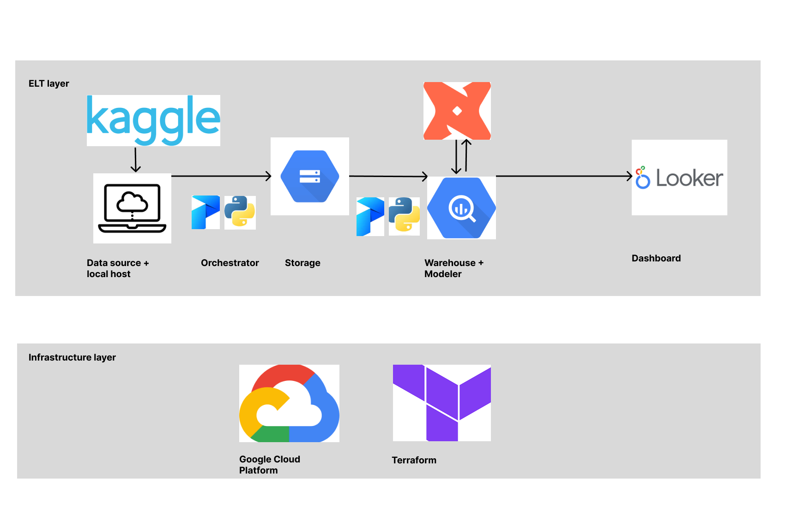
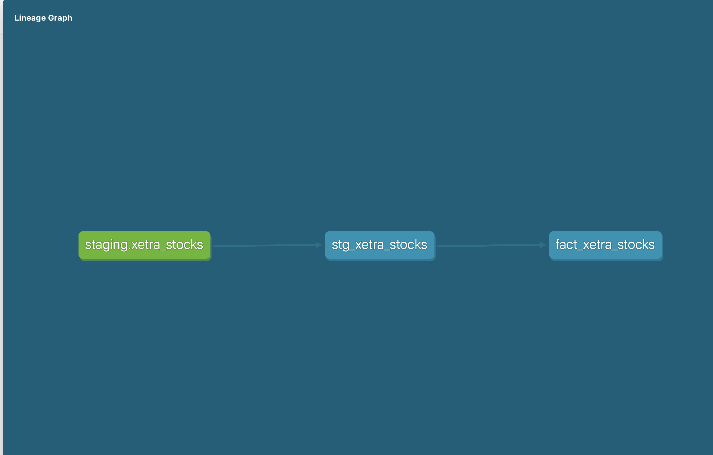
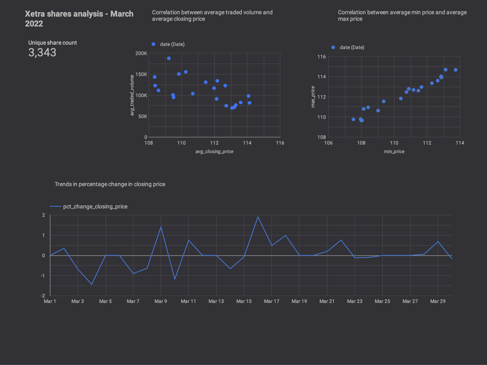

# Xetra trading exchange - Stock price analysis
This project was created as part of finale for the DataTalksClub - Data Engineering Zoomcamp 4 week course. [Xetra](https://www.xetra.com/xetra-en/) is a tradding platform operated by the Frankfurt tock Exchange based in Frankfurt, Germany. It allows trading in all financial instruments including shares, ETFs and ETPs. It has a significant market share throught Europe

## Problem Description
The goal of the project is to build and end to end data pipeline that will store data, aggregated to one minute interval, containing stocks prices from 2022-01-03 to 2022-04-25; this will be stored on Google Cloud Storage. From here, it will be tranformed using dbt and the cleaned table will be stored in BigQuery; the final dataset is available to the end user to create reports and dashboards. The dataset, in its current form, is static in nature as it is no longer available [here](https://github.com/awslabs/open-data-registry/blob/main/datasets/deutsche-boerse-pds.yaml). So I have made it available on [Kaggle](https://www.kaggle.com/datasets/laxmsun/xetra-stocks)

## Technology Stack 
The following technologies have been used
- Google Cloud Storage (GCS) <br>
- Google BigQuery<br>
- Terraform<br>
- Prefect<br>
- dbt<br>
- Google Looker studio <br>

## Data Pipeline Architecture


## dbt lineage


## Data Dictionary
The following describes the schema for table - xetra_stocks which
holds the data coming from the source
|Field name    |Type     |Description                               | 
|--------------|---------|------------------------------------------|
|ISIN          | STRING  |Unique security identifier                |
|Mnemonic      | STRING  |Abbreviated security ID                   |
|SecurityDesc  | STRING  |Security Description                      |
|SecurityType  | STRING  |Type of security                          |
|Currency      | STRING  |Currency                                  |
|SecurityID    | INTEGER |Security ID                               |
|Date          | DATETIME|Transaction date                          |
|Time          | TIME    |Transaction time                          |
|StartPrice    | FLOAT   |Opening price                             |
|MaxPrice      | FLOAT   |Maximum price                             |
|MinPrice      | FLOAT   |Minimum price                             |
|EndPrice      | FLOAT   |Closing price                             |
|TradedVolume  | INTEGER |Total volume of shares traded at that time|
|NumberOfTrades| INTEGER |Number of trades placed at that time      |
|key           | STRING   |Unique record identifer                  |

The `stg_xetra_stocks` table ensures that no duplicates are loaded; it has a subset of the fields
from the raw table
`fact_xetra_stocks` is an aggregated table built on top of the `stg_xetra_stocks`

## Dashboard


The analysis is for the month of March 2022
1) The top left card shows the total number of unique shares traded in that month
2) The chart at the top middle shows the correlation between average traded volume and average closing price
3) The chart at the top right corner shows the correlation between the average minimum price and average maximum price
4) The chart at the bottom displays the trend for the percent change in closing price

## Steps to reproduce the project
1. Prerequisites
<details>
<summary>Google Cloud Platform Account</summary>

Note - If you have already done these steps then it is not required.

- Sign up for a free account [here](https://cloud.google.com/free/), and enable billing.
- Create your project
- Create a service account under IAM & Admin
- Grant the following roles - Storage Admin + Storage Object Admin + BigQuery Admin
- Click Add keys, and then crete new key. Download the JSON file

Enable Google authentication
```
export GOOGLE_APPLICATION_CREDENTIALS=<path/to/your/service-account-authkeys>.json
gcloud auth activate-service-account --key-file $GOOGLE_APPLICATION_CREDENTIALS
gcloud auth application-default login
```


</details>

<details>
<summary>Google Cloud SDK</summary>

Installation instruction [here](https://cloud.google.com/sdk/docs/install-sdk).

</details>

<details>
<summary>Prefect Cloud</summary>

Sign up for a free account [here](https://www.prefect.io).

</details>

<details>
<summary>Terraform</summary>

You can view the [installation instructions for Terraform here](https://developer.hashicorp.com/terraform/downloads?ajs_aid=f70c2019-1bdc-45f4-85aa-cdd585d465b4&product_intent=terraform)

</details>

1. Clone the repo

```
git clone https://github.com/sl2902/xetra.git
cd xetra
```

2. Create a virtual environment 
```
python -m venv xeta_venv 
source xeta_venv/bin/activate
```

3. Install dependencies with poetry
```
poetry install --no-root
```

4. Rename the `project_env` file
```
mv project_env .project_env
```
4a. Make sure to add this file to .gitignore

5. Download the dataset from Kaggle
5a. Either click the Download button on this [page](https://www.kaggle.com/datasets/laxmsun/xetra-stocks) to download
the dataset. Note - the file when downloaded is named `archive.zip`
5b. You could also create a Kaggle API, and use the API to download the file, like so
```
kaggle datasets download -d laxmsun/xetra-stocks
unzip xetra-stocks.zip
```
5c. In the project directory, store the dataset in the following directory
```
mkdir data/xetra/
cd data/xetra
```
5d. As the zipped file is stored inside a folder called `dataset`. We will copy all the folders inside `dataset` to `data/xetra/`.
While inside `dataset` directory, run the following
```
cp -R * ../
```
This will copy the files to the `data/xetra/` folder.
5e. Delete the dataset folder
```
rm -rf dataset
cd ../../
``` 
Back in the project directory

6. On [Prefect Cloud](https://app.prefect.cloud/) create a workspace and an API Key
6a. Populate the following global variables in `.project_env` file
`PREFECT_KEY`
`PREFECT_WORKSPACE`

6b. Run this command so that the variables are exported to the current session
```
set -o allexport && source .project_env && set +o allexport
```

6c. In the project folder, run the following commands on the terminal
```
prefect cloud login -k ${PREFECT_KEY}
prefect cloud workspace set --workspace ${PREFECT_WORKSPACE} &&\
prefect config view &&\
```

This will return the PREFECT API URL. Update
`PREFECT_API_URL` in `.project_env` file

7. Update the following environment variables in the `.project_env` file and the `config.json` file<br>
        - CONFIG_FILE<br>
        - GCP_PROJECT_ID<br>
        - GCP_SERVICE_ACCOUNT_NAME<br>
        - LOCAL_SERVICE_ACCOUNT_FILE_PATH<br>
        - GCP_REGION<br>
        - PREFECT_API_KEY - Only config.json<br>
        - PREFECT_API_URL - Only config.json<br>
Note - in the `config.json` file, the `GCP_SERVICE_ACCOUNT_NAME` key is not required.
The `config.json` file is used in the Prefect block script `create_config.py`

8. Make sure that the profile name you create in `~/.dbt/profiles.yml` is called `xetra`

9. Run this command so that the variables are exported to the current session
```
set -o allexport && source .project_env && set +o allexport
```

10. Run the block scripts
```
python scripts/create_config.py
python scripts/create_gcp_credentials.py
```

11. The files in the `config` folder serve the following purposes
`datasets_loaded.csv` - Keeps track of which dated datasets have been uploaded to BigQuery
`history_dataload.json` - Used for one time load as the dataset is static; the format is `load_date :[2022-01, 2022-03]
Should you wish, you can populate it to include all the available months, which is 2022-01-03 - 2022-04-25

12. Create the GCP storage bucket and GCP BigQuery Dataset
```
cd terraform
terraform init
terraform plan
terraform apply
```
After initializing Terraform, prepare plan to be applied, then deploy the resources

13. Run the Python script that copies the dataset from your local machine to GCP Storage
Make sure the Python env is activated
```
python local_to_gcs.py
```
It roughly takes an hour to load all the data

14. The second script could be run in 2 modes:
14a. You could load all the datasets from Cloud storage to Bigquery, like so.
```
python gcs_to_bq.py --history_file config/history_dataload.json
```
Make sure you have updated the values as shown in step 10. Or, you could
just run it for one specific date
```
python gcs_to_bq.py --date 2022-03-23
```
Note - For some dates, there maybe no data

This step should produce data in the fact table which is called `fact_xetra_stocks`

## Next steps

1. Complete the prefect Dockerization step
2. Deploy the same code using Cloudrun, Artefact Registry and Github Actions
3. Adding test cases.
